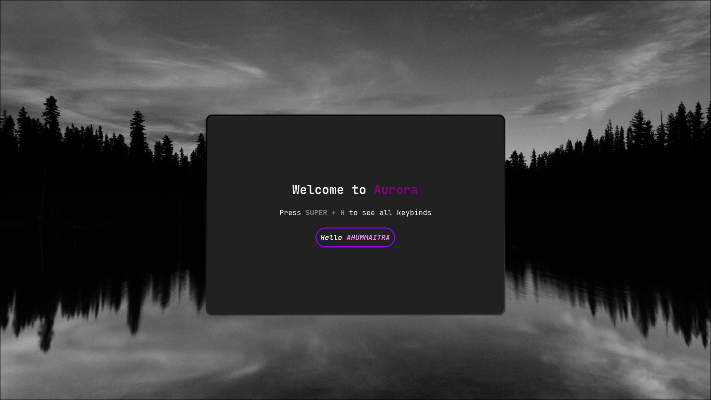

After installtion, now we need to get familar with Aurora. 

> [!IMPORTANT]
>After installation please restart your session

After your first login, you should see `Aurora's Welcome app`. It will welcome you to the system everytime you log in.

This is a gtk app. You can close this welcome app by pressing `ESCAPE` key.

## Keybinds help
As you can see, you need to know some keybinds to get familiar. Press `SUPER + H` to launch keybinds help app. It will guide you with keybinds.

> [!IMPORTANT]
> Super key mean `Window` key on your keyboard

## Some crucial keybinds 
| Keybind  | Action |
| :---- | :-- |
| `SUPER + H`   | To open the keybinds help app  |
| `SUPER + R` | to launch app launcher  |
| `SUPER + Q` | To launch default terminal  |
| `SUPER + C` | To close active window |

If you are new to Hyprland, you may wonder what's that in the top. It's `Waybar`. It is very useful for Hyprland users.  You can see currently it shows you the workspaces number (which is 10 in Aurora by default). It also shows clock (you can see calender by hovering it). Also volume level and battery percentage and wifi and bluetooth, etc.

## TUIs in Aurora
Aurora comes with bunch of useful TUIs. Which are very useful.

### Wifi Manager
`wifitui`

### Bluetooth Manager
`bluetui`

### Playback manager
`wiremix`

### Weather Monitor
`weathr`

### System resources monitor 
`bottom`

## Battery monitor
`jolt`

**These TUIs helps Aurora to be more user friendly and aesthetic**

You can view Aurora's settings by pressing `SUPER + SHIFT + Z`

>[!IMPORTANT]
> `Super` key means the `Window` key in your keyboard