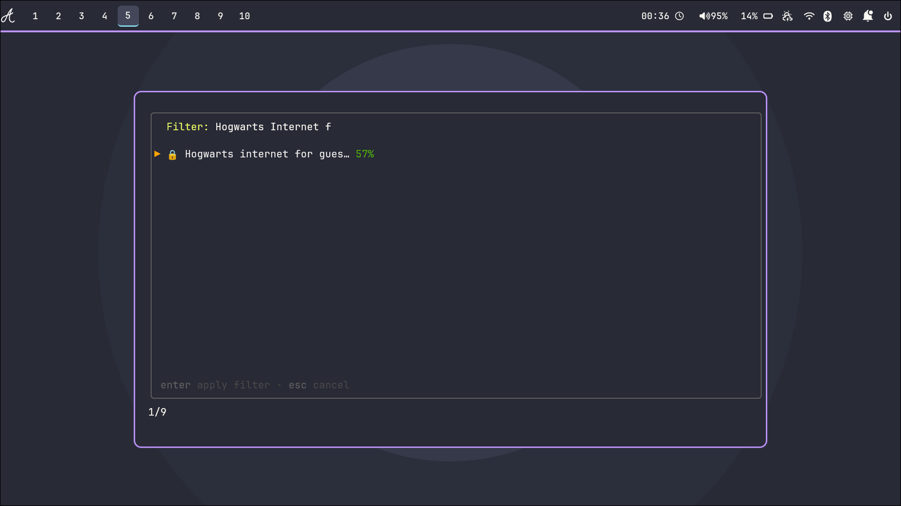
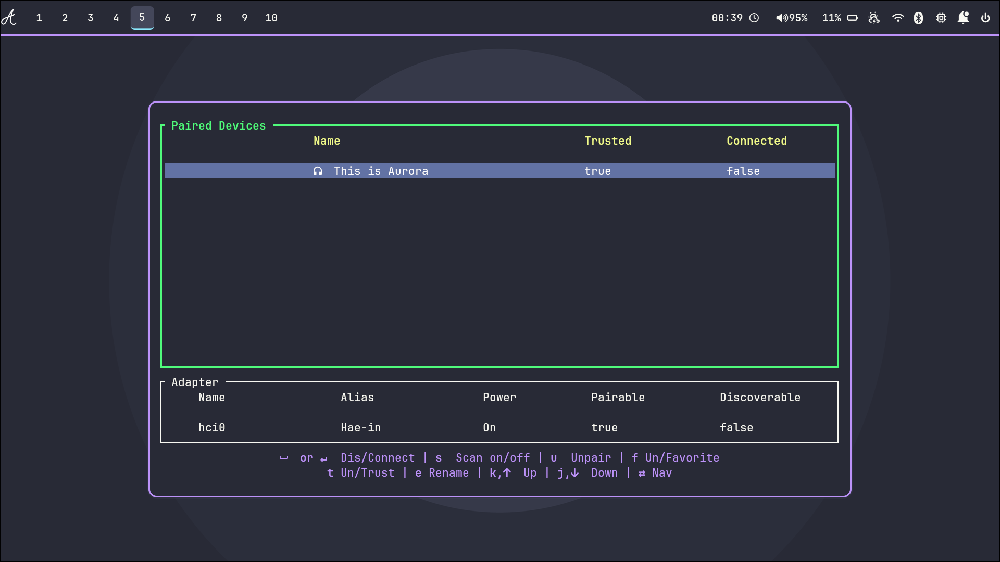
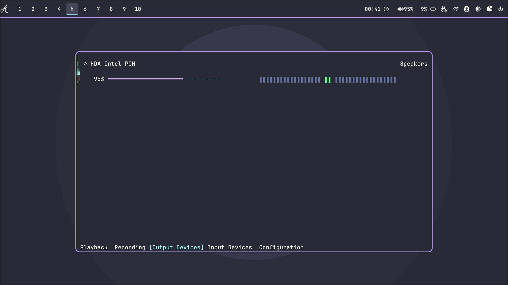
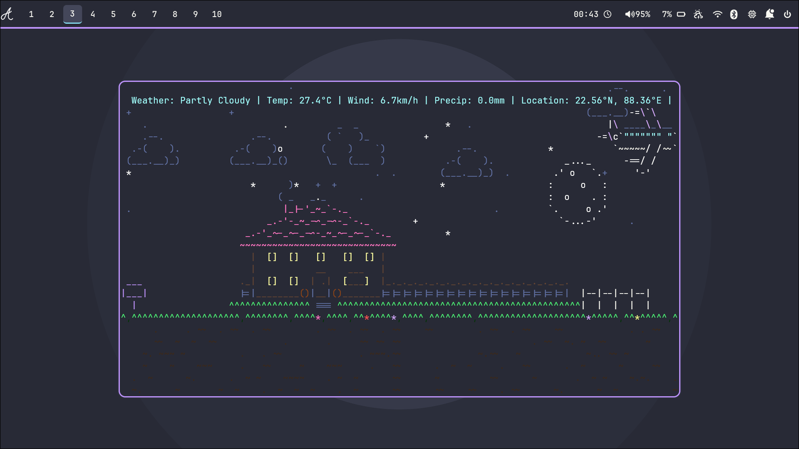
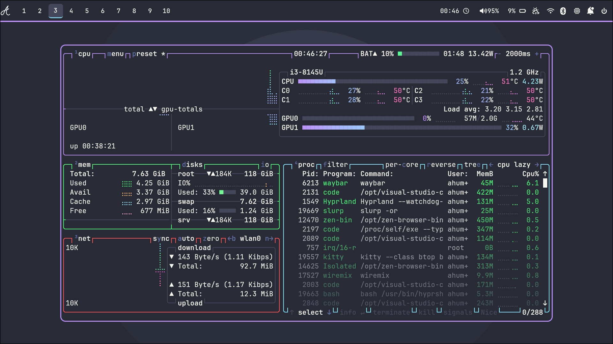
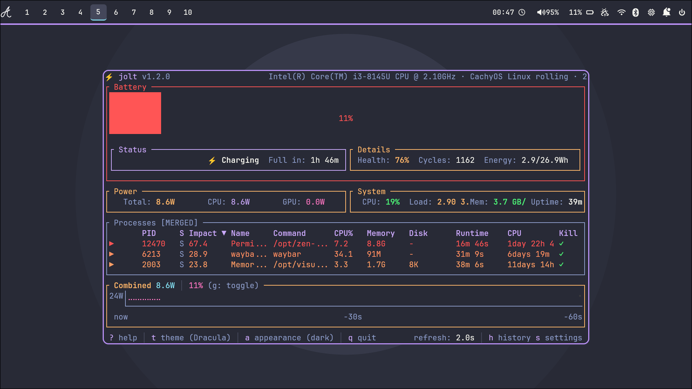

Aurora comes with many TUIs and GUIs to enhance user experience.

**Here are some special unique ones :-**

## TUIs in Aurora
Aurora comes with bunch of useful TUIs. Which are very useful.

### Wifi Manager
#### `wifitui`
This TUI helps to manage wifi connections. 

### Bluetooth Manager
#### `bluetui`
This TUI helps to pair, forget and many more with bluetooth connections

### Playback manager
#### `wiremix`
This TUI helps to increase volume level in a specific window or speaker and comes with many features!

### Weather Monitor
#### `weathr`
This TUI shows weather information in a very cool ASCII style!

### System resources monitor 
#### `btop`
Helps to show crucial information about system in a very cool statistically graphical way!

### Battery resource monitor
#### `jolt`
Helps to show various information about battery!
